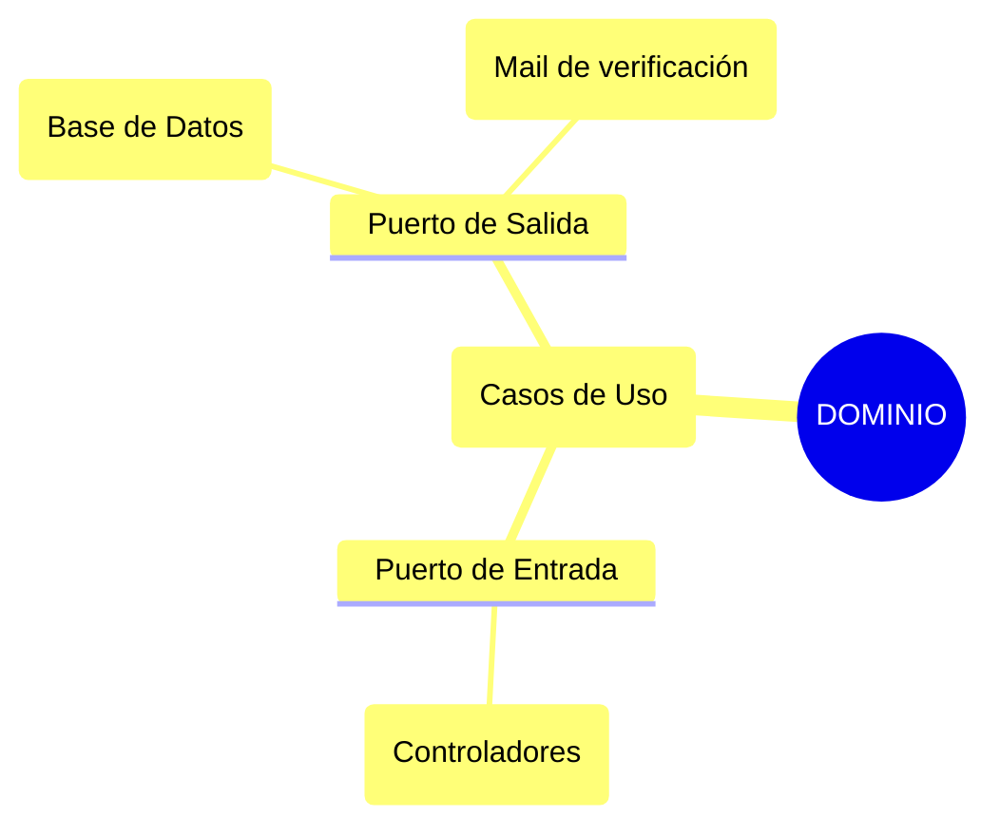
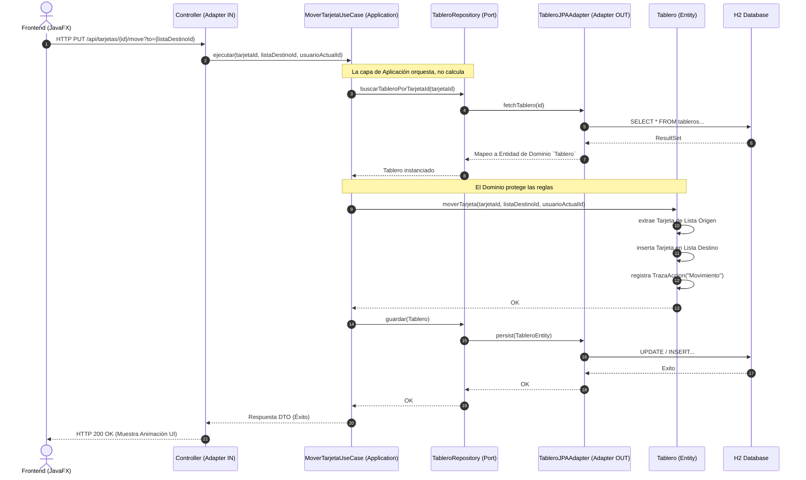

# Decisiones de Diseño y Arquitectura

Aquí vamos a explicar las diferentes decisiones y dilemas que nos hemos encontrado en la realización de la práctica.

## 1. Estructura del Repositorio y Separación de Proyectos

### 1.1 Separación de Frontend y Backend
Hemos decidido separar el cliente y el servidor en dos proyectos Maven independientes, aunque conviven dentro del mismo repositorio:
- **Backend (`ProyectoPDS`):** Tiene la lógica de negocio, reglas de dominio y la persistencia de datos. Todo lo expone mediante una API REST.
- **Frontend (`ProyectoPDS-GUI`):** Se encarga de la interfaz de usuario y la interactividad con el backend.

Al mantener ambos en un mismo repositorio facilita el control con git y ha agilizado el desarrollo, haciendo que los cambios en la API se reflejen inmediatamente en el frontend sin tener que cambiar entre repositorios.

### 1.2 Conexión entre Frontend y Backend
La comunicación entre ambos proyectos se realiza con **peticiones HTTP**.
- El backend expone endpoints REST.
- El frontend actúa como un cliente HTTP y consume estos endpoints.
- Se usa **Jackson** para convertir los objetos java a JSON y viceversa, asegurando un intercambio de información estandarizado

## 2. Arquitectura de Capas y Aislamiento

El backend emplea **Arquitectura Hexagonal**, organizando el código en tres capas principales: Dominio, Aplicación y Adaptadores.

### Diagrama de Arquitectura Hexagonal

Esto lo hacemos porque como observamos en teoría nos da más independencia y desacoplamiento, haciendo que si dejamos de usar JPA y usamos MariaDB no tengamos que cambiar todo el backend, únicamente tendremos que cambiar el adaptador JPA. Lo hemos dividido de la siguiente forma:
- **Capa de Dominio:** Está completamente aislada. No contiene ninguna dependencia de Spring Boot, JPA ni bases de datos. Es Java puro. Esto asegura que la lógica de negocio sobreviva a cualquier cambio tecnológico.
- **Capa de Aplicación:** Solo depende del Dominio. Contiene los Casos de Uso y orquesta las llamadas entre el dominio y los puertos de salida, pero no implementa lógica.
- **Capa de Adaptadores:** Está acoplada a los frameworks y librerías. Su única responsabilidad es traducir las peticiones del exterior hacia la aplicación, y las respuestas de la aplicación hacia el exterior. 

### 2.2 Controladores y Casos de Uso (`adapters.in`)
Dentro de los adaptadores de entrada (`adapters.in`), encontramos los **Controllers** (Adaptadores REST). Su función se limita a recibir la petición HTTP, validar la entrada básica, extraer la información y pasársela a un **Caso de Uso**, que está en la capa de Aplicación. Los controladores *nunca* contienen lógica de negocio, solo sirven como puente entre la API y nuestra aplicación.

## 3. Decisiones de Modelado

### 3.1 Uso de Clases como Identificador
En lugar de usar tipos primitivos (como `String` o `Long`) para representar los identificadores de entidades, hemos optado por usar clases envolventes como identificador.

### 3.2 Gestión de DTOs
Los DTOs se utilizan exclusivamente en las **fronteras del sistema**, es decir, en la capa de adaptadores, por ejemplo, entre el Controlador REST y el Cliente.

Usamos DTOs para definir la estructura exacta de los datos que entran o salen de la API. Así evitamos exponer el modelo de dominio interno al mundo exterior. Por lo tanto, no usamos DTOs dentro de la capa de Dominio, que trabaja con Entidades y Value Objects puros. 

## 4. Persistencia y Configuración

### 4.1 Elecciones de JPA (`adapters.out.jpa`)
La capa de persistencia se implementa como un Adaptador Secundario utilizando **Spring Data JPA** y una base de datos en memoria **H2** para agilizar el desarrollo.

**Justificación:**
- Se asume un mapeo doble: Las Entidades JPA (anotadas con `@Entity`, `@Table`) son distintas de las Entidades de Dominio puro. El adaptador JPA se encarga de traducir la Entidad de Dominio a Entidad JPA para guardarla, y viceversa al recuperarla.
- Esto mantiene el Dominio limpio de anotaciones de Hibernate/JPA, permitiendo cambiar la estrategia de base de datos en el futuro sin modificar ni una sola línea de la lógica de negocio.

### 4.2 El uso de `application.properties`
Toda la configuración técnica, como la URL de la base de datos, puertos del servidor, configuraciones de Hibernate y credenciales para el envío de correos, se externaliza en el fichero `application.properties`.

**Justificación:**
Cumple con el principio de configuración externa (Twelve-Factor App). Permite que la aplicación cambie su comportamiento en distintos entornos (desarrollo, pruebas, producción) simplemente modificando un archivo de propiedades o inyectando variables de entorno, sin necesidad de recompilar el código fuente.

## 5. Ejemplo de Flujo de Comunicación

El siguiente diagrama muestra de forma práctica cómo todas estas decisiones arquitectónicas interactúan en un flujo real (ej. Mover una Tarjeta). Observamos claramente la separación de DTOs en el REST, la delegación al Caso de Uso y el aislamiento del Dominio frente a la persistencia JPA.

