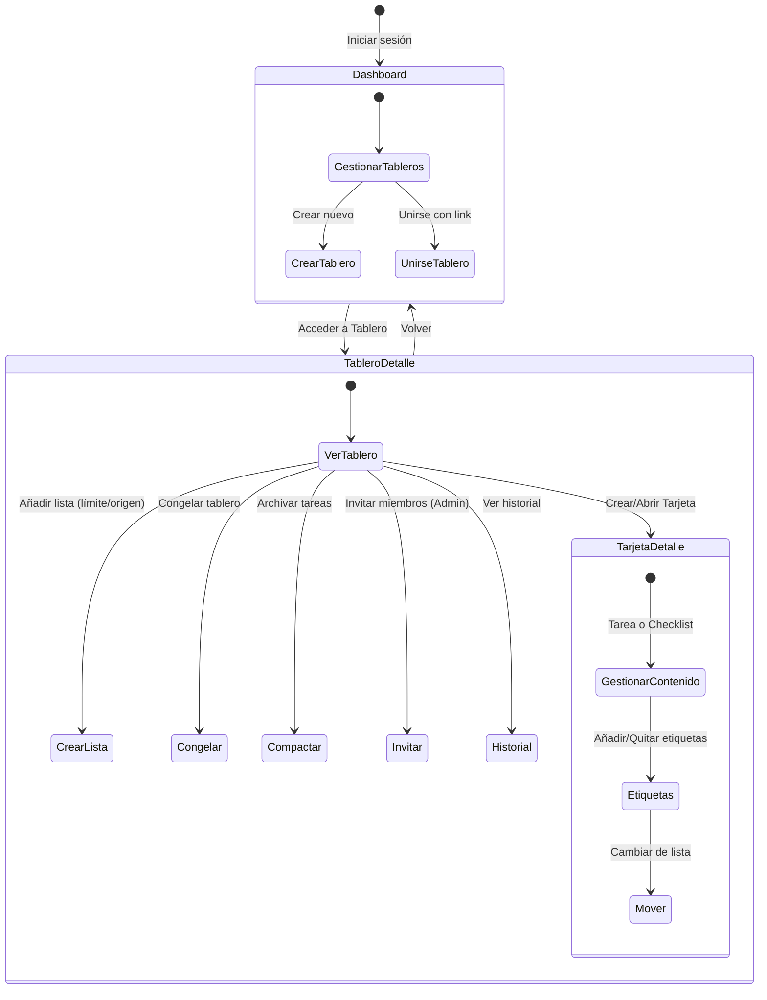

# Manual de Usuario - Gestor de Proyectos Kanban

Bienvenido al manual de usuario de la aplicación. Esta herramienta es un gestor de proyectos y tareas basado en la metodología Kanban (con un estilo similar a Trello), diseñada para facilitar la organización personal y la colaboración en equipo.

---

## 1. Primeros Pasos: Acceso y Seguridad

Para comenzar a utilizar la aplicación, es necesario tener un correo electrónico al que enviar el código de verificación
1. **Registro/Login:** En la pantalla de inicio escribe tu correo electrónico .
2. **Verificación por Correo:** El sistema enviará un código de verificación a tu correo electrónico. 
3. **Activación:** Introduce este código en la pantalla de verificación para iniciar sesión.

---

## 2. El Panel Principal (Dashboard)

El Dashboard es tu centro de control. Desde aquí puedes gestionar todos tus espacios de trabajo.

### 2.1. Gestión de Tableros
- **Mis Tableros:** Muestra todos los tableros que tú has creado. Tú eres el Administrador de estos tableros.
- **Crear Tablero:** Te permite iniciar un tablero desde cero dándole un nombre.
- **Unirse a un Tablero:** Si tienes un link de invitación proporcionado por otro usuario, puedes introducirlo aquí para sumarte al tablero.

---

## 3. Área de Trabajo del Tablero

Al entrar en un tablero, accedes a la vista avanzada donde ocurre la gestión real del tablero.

### 3.1. Listas
Las listas representan las fases de tu proyecto.
- **Crear Lista:** Puedes añadir tantas listas como necesites para reflejar tu flujo de trabajo.
  - Cuando se crea una lista se puede establecer un límite de tareas, si no se establece un límite, no habrá.
  - También se puede establecer la lista de la que proviene la que tiene que venir la tarea para el correcto flujo.

### 3.2. Tarjetas
Las tarjetas son las unidades individuales de trabajo.
- **Crear Tarjeta:** Se añaden en la lista correspondiente, se pueden poner etiquetas, descripción, título, si es checklist o tarea.
  - Si es checklist se pueden añadir los items que se requieran.
  - Si es tarea se puede poner como texto una descripción de la tarea.
- **Movimiento (Flujo):** Puedes mover las tarjetas de una lista a otra a medida que el trabajo avanza.

### 3.3. Sistema de Etiquetas
El sistema cuenta con un **Gestor de Etiquetas** visual:
- Permite crear etiquetas con colores y nombres descriptivos (ej. "Prioridad Alta", "Bug", "Frontend").
- Puedes asignar múltiples etiquetas a una misma tarjeta para facilitar su filtrado y reconocimiento visual rápido.

### 3.4. Congelación
El tablero se puede congelar, inhabilitando la posibilidad de crear listas o tarjetas, pero si permitiendo el movimiento entre listas, el estado persiste

### 3.5. Compactación
El tablero se puede compactar, pudiendo mover con un sólo click todas las tareas que tengan más de X tiempo de antigüedad (1 día, 1 semana, 1 mes), se archivan automáticamente, y se pueden desarchivar si se desea.

---

## 4. Colaboración

Dependiendo de tu rol en el tablero, tendrás diferentes capacidades.

### 4.1. Roles y Permisos
- **Administrador/Escritor:** Tiene control total. Puedes, crear/editar/eliminar listas y tarjetas y gestionar el acceso de otros miembros.
- **Lector:** Puede solo observar los detalles de las tarjeta, los miembros y gestionar las etiquetas, no puede añadir, ni editar, ni eliminar tarjetas o listas, ni invitar a nuevos miembros.

### 4.2. Invitar Miembros
- El Administrador puede invitar a nuevos integrantes generando links únicos de invitación para cada usuario. 
- Los miembros invitados tendrán que unirse al tablero de la manera [comentada anteriormente](#21-gestión-de-tableros), tendrán acceso al entorno colaborativo.

### 4.3. Historial de Actividad
- El tablero registra las acciones en los tableros. Esto permite auditar qué usuario realizó qué acción.

---

## 5. Diagrama de Flujo de Acciones

