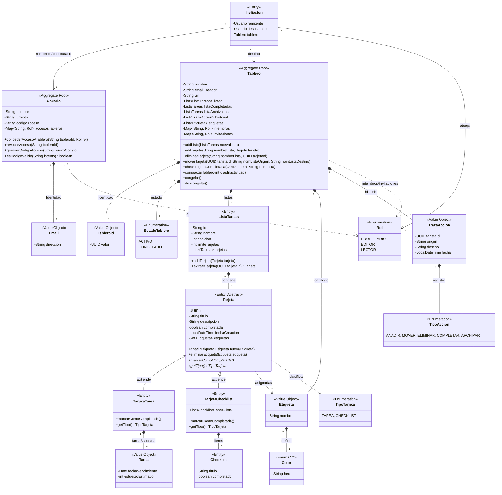

# Modelo de Dominio

El centro del sistema ha sido diseñado siguiendo los principios de **Diseño Orientado al Dominio (DDD - Domain Driven Design)**, separando responsabilidades y creando un modelo de negocio con entidades ricas y reglas propias. Toda la lógica se concentra estrictamente en la capa de dominio (`umu.pds.api.domain.models`), aislando el núcleo de la aplicación de frameworks o bases de datos externas.

## 1. Aggregate Roots

El sistema se estructura en torno a agregados, que son grupos de entidades y objetos de valor tratados como una única unidad de consistencia de datos.

1.  **`Usuario`**: Es el Aggregate Root que gestiona la cuenta, autenticación (email, password/código), estado de verificación y controla sus roles y permisos en distintos tableros (`accesosTableros`). Su identificador principal recae en el Value Object `Email`.
2.  **`Tablero`**: Es el Aggregate Root principal del ecosistema Kanban. El tablero contiene y controla todo su flujo de trabajo: sus `ListaTareas` (y, a través de ellas, las `Tarjetas`), las `Etiqueta`s globales permitidas, el historial de `TrazaAccion` para auditoría, y las `Invitacion`es. Nadie modifica una lista o tarjeta directamente sin pasar por las validaciones de negocio del `Tablero`.

## 2. Value Objects, Enums y Entidades Clave

En nuestro dominio puro encontramos distintos tipos de construcciones:
*   **Value Objects (VO):** Objetos inmutables definidos por sus valores, no por identidad. Destacan `Email` (asegura el formato de correo), `Etiqueta` (compuesta por nombre y `Color`), `Tarea` (fecha y esfuerzo estimado) y `TrazaAccion` (registro inmutable).
*   **Identificadores Fuertes (Strongly Typed IDs):** Se emplea `TableroId` en lugar de Strings genéricos para fortalecer el tipado y evitar errores en el paso de parámetros.
*   **Jerarquía de Tarjetas:** En lugar de campos nulos para funcionalidades dispares, se usa polimorfismo. `Tarjeta` es una clase abstracta (con un ID, título, descripción y conjunto de etiquetas). Sus especializaciones son `TarjetaTarea` (conecta a una única `Tarea`) y `TarjetaChecklist` (contiene una lista de sub-ítems `Checklist`).
*   **Enumeraciones:** Tipos fijos que estandarizan los estados del dominio, como `EstadoTablero` (ACTIVO, CONGELADO), `Rol` (PROPIETARIO, EDITOR, LECTOR), `TipoAccion` y `TipoTarjeta`.

## 3. Diagrama de Clases de Dominio (UML)

El siguiente diagrama detalla la estructura completa de la capa de dominio, incluyendo todos los *Aggregate Roots*, *Entidades*, *Value Objects* y *Enumerados*, así como las relaciones funcionales entre ellos, basándose en la implementación real de `umu.pds.api.domain.models`.

