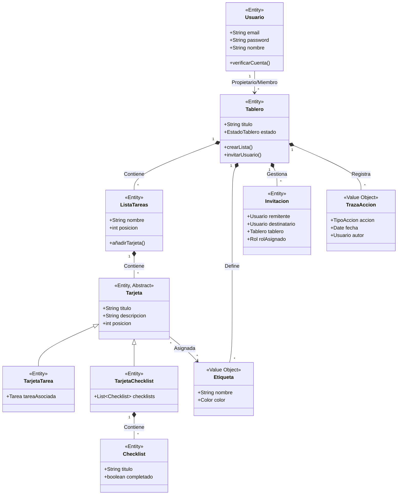

### Modelo
El sistema está diseñado utilizando principios de Diseño Orientado al Dominio (DDD - Domain Driven Design), separando claramente las responsabilidades y modelando el negocio alrededor de entidades ricas.
*   **Bounded Context Principal (Gestión Kanban):** Agrupa todo lo referente al flujo de trabajo. El *Aggregate Root* principal es el **Tablero**, que contiene **ListaTareas**. A su vez, las listas contienen **Tarjetas**, que pueden ser de diferentes tipos (**TarjetaTarea** o **TarjetaChecklist** con **Checklists**). Se les puede asociar **Etiquetas**.
*   **Bounded Context de Identidad y Acceso:** Gestiona el **Usuario**, los **Roles** y los **Permisos**.
*   **Bounded Context de Colaboración:** Gestiona las **Invitaciones** y la **TrazaAccion** (historial de eventos para auditoría/actividad).
**Diagrama de Dominio (Mermaid):**

## Documentacion

