### Pantallas

El sistema cuenta con las siguientes pantallas principales (GUI en JavaFX):

*   **Autenticación:**

    -    `Login`: Inicio de sesión de usuarios.

    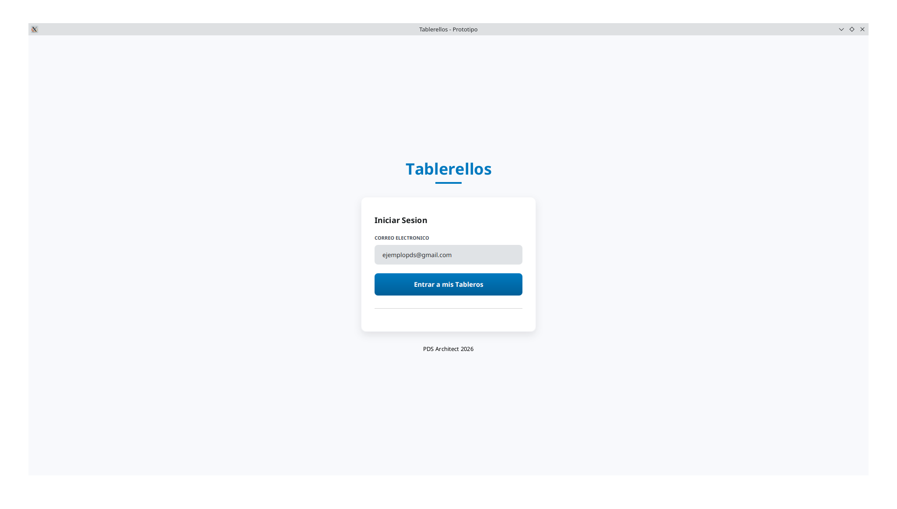    

    -    `Verify`: Verificación de cuenta/email.

    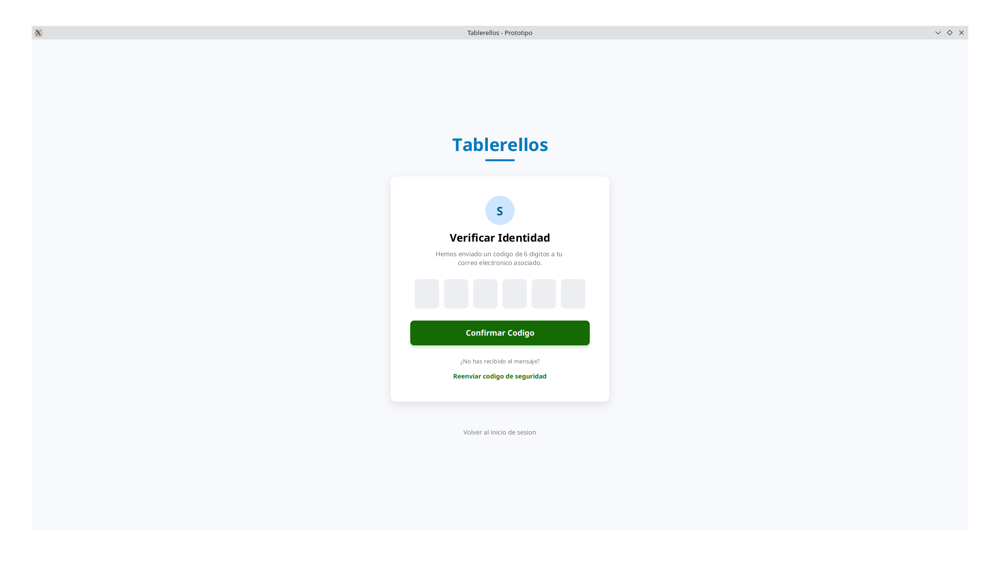

*   **Navegación Principal:**

    -    `Dashboard`: Panel principal donde se listan los tableros del usuario.

    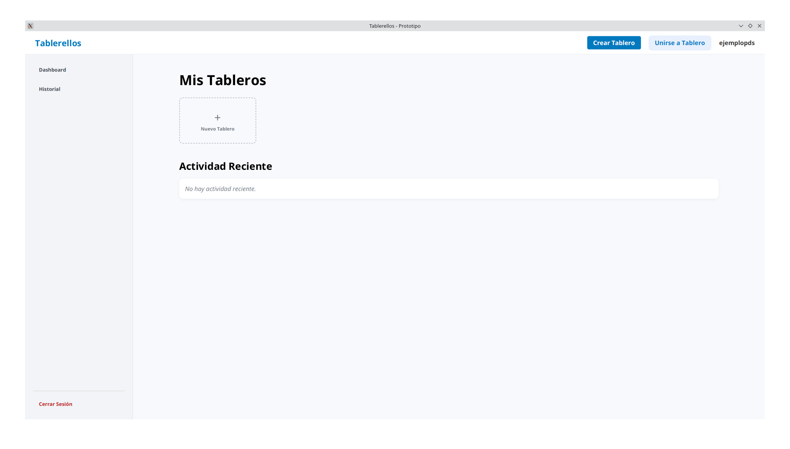
    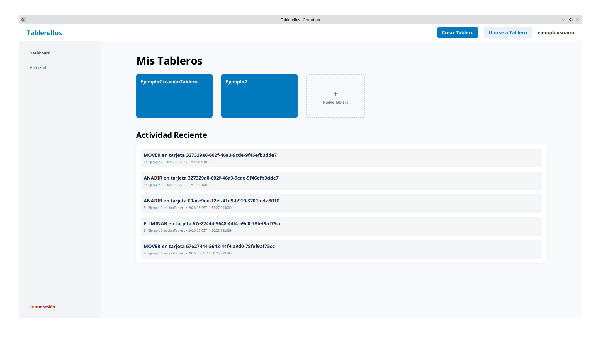

    -    `EditarPerfil`: Interfaz para modificar datos del usuario.

    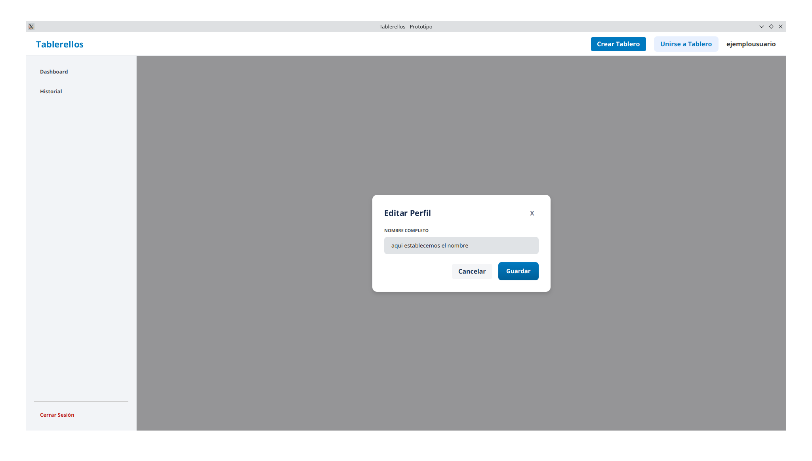

    
*   **Gestión de Tableros:**

    -    `CreateBoard`: Creación de un nuevo tablero.

    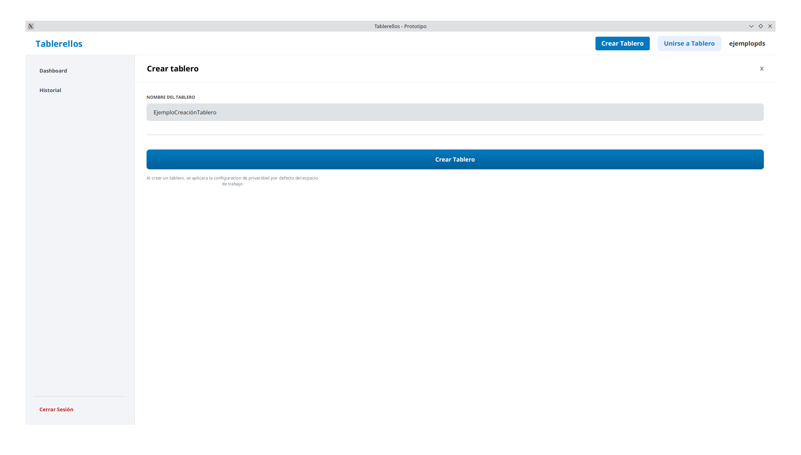

    -    `BoardWorkspace` / `TableroAvanzado`: Vista detallada del tablero (Kanban view).

*   **Gestión de Tareas (Kanban):**

    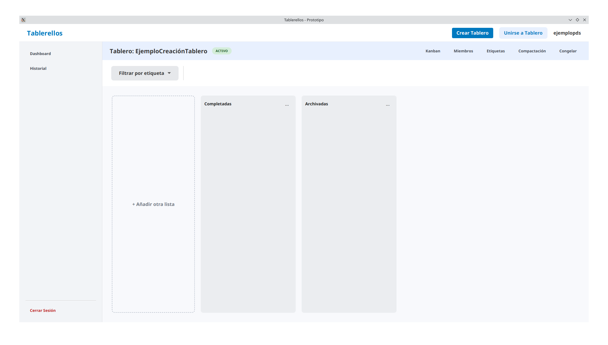

    -    `CreateList`: Creación de una nueva columna en el tablero.

    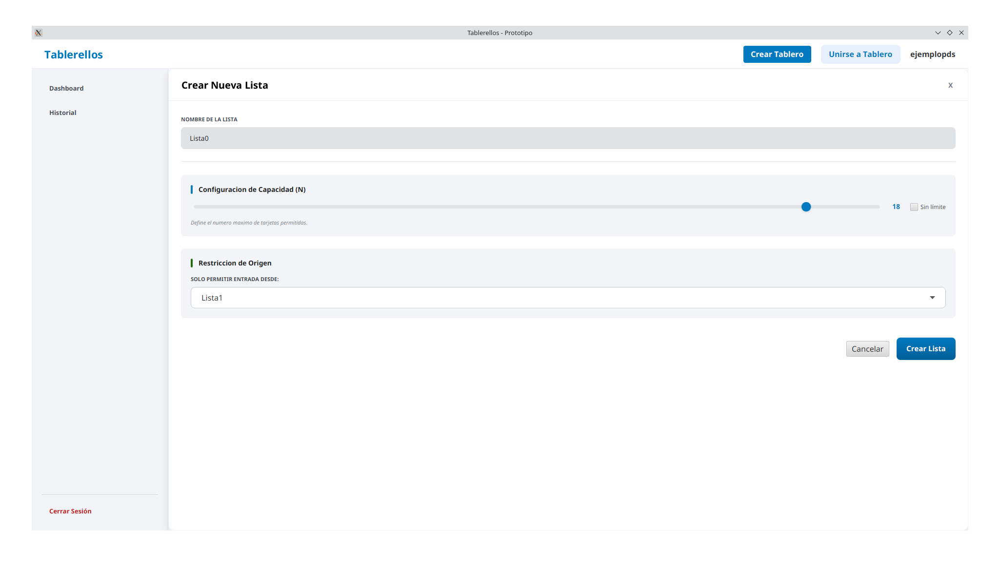

    -    `CreateCard`: Creación rápida de una tarjeta.

    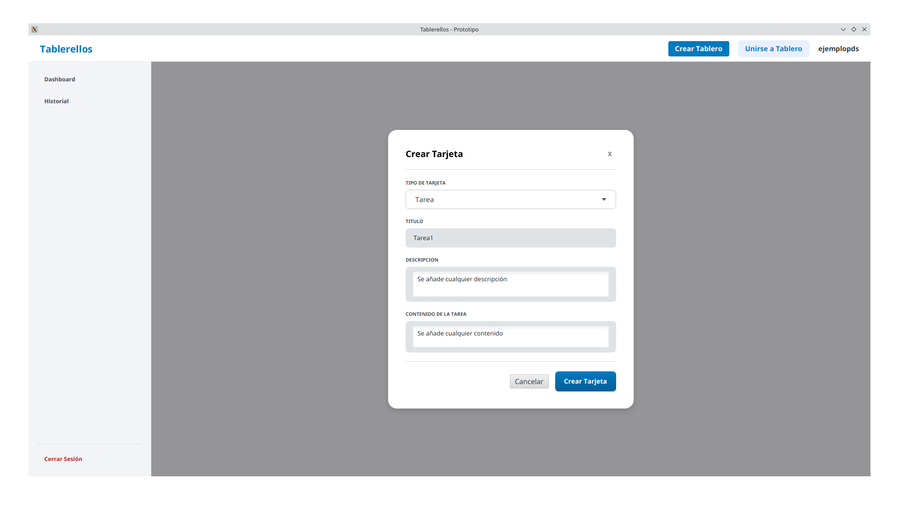
    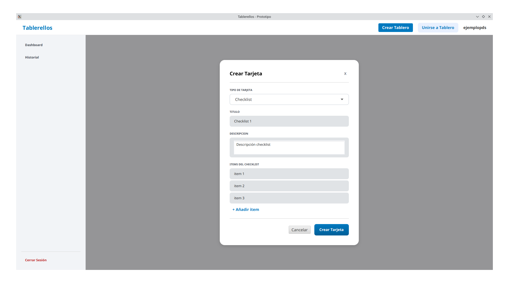

    -    `TaskDetail`: Vista detallada de una tarjeta (descripción, checklist, etiquetas).

    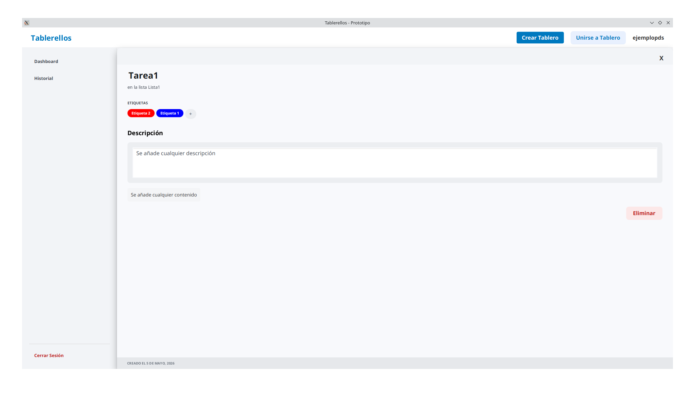
    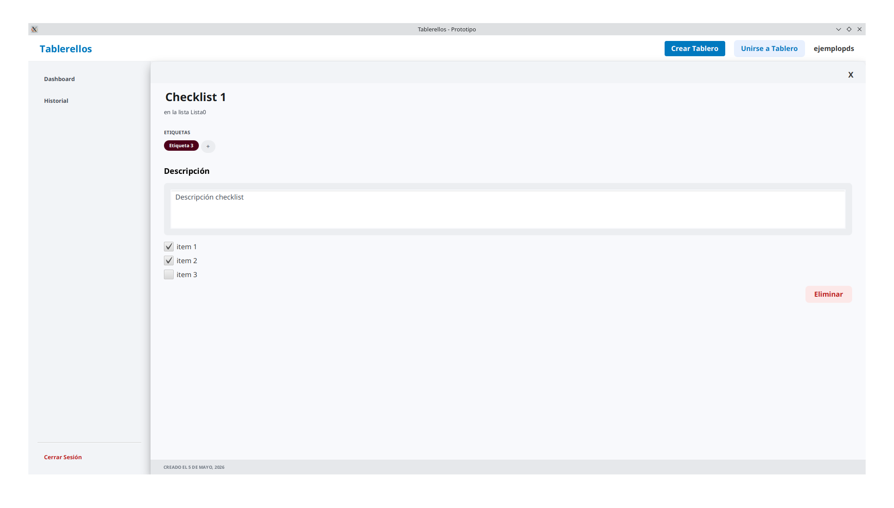

*   **Gestión de Elementos Adicionales:**

    -    `GestorEtiquetas` / `Etiquetas`: Creación y asignación de etiquetas personalizadas por colores.

    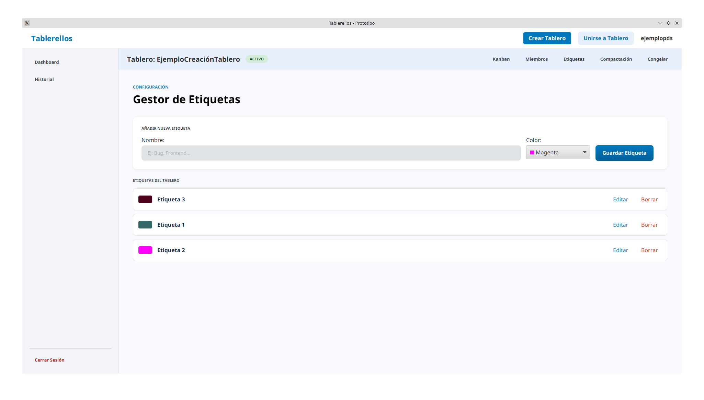

*   **Colaboración:**

    -    `InvitarMiembro` / `UnirseTablero`: Interfaces para añadir nuevos usuarios al tablero.

    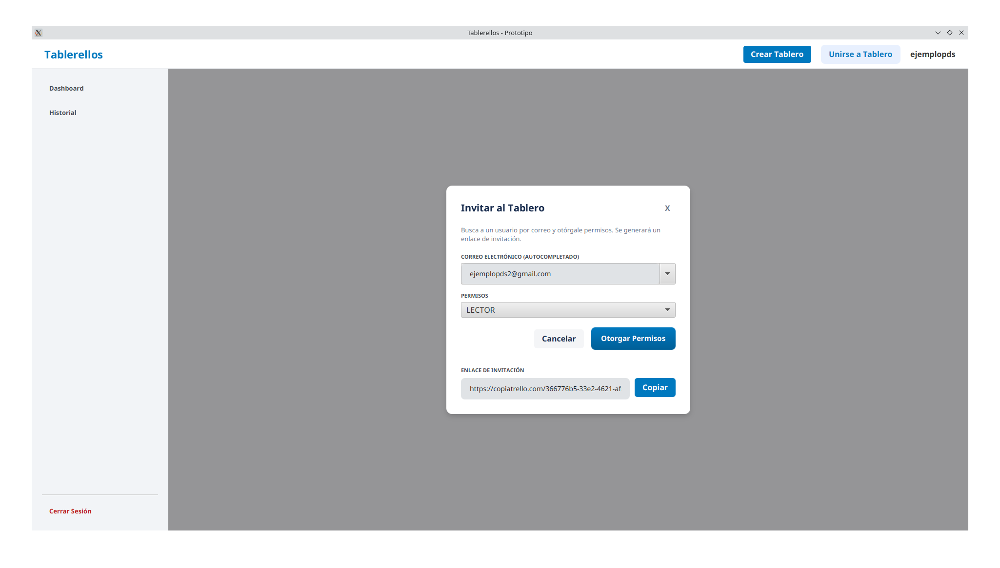

    -    `Permisos`: Vista de los permisos de los usuarios en el tablero.

    

*   **Historial:**

    -    `Activity`: Visualización de la traza de acciones y eventos del tablero.

    

